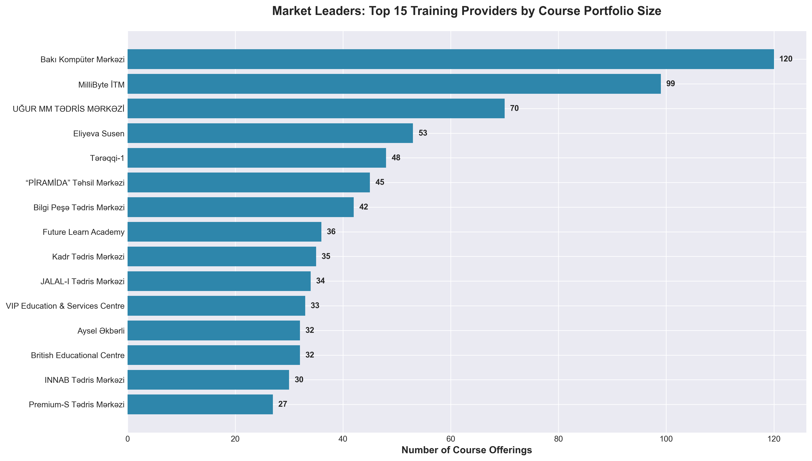
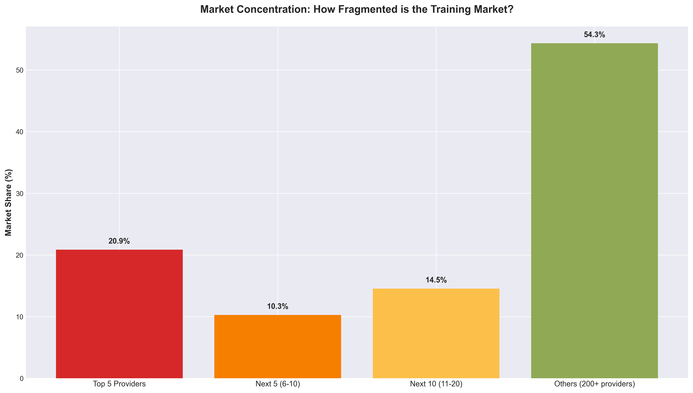
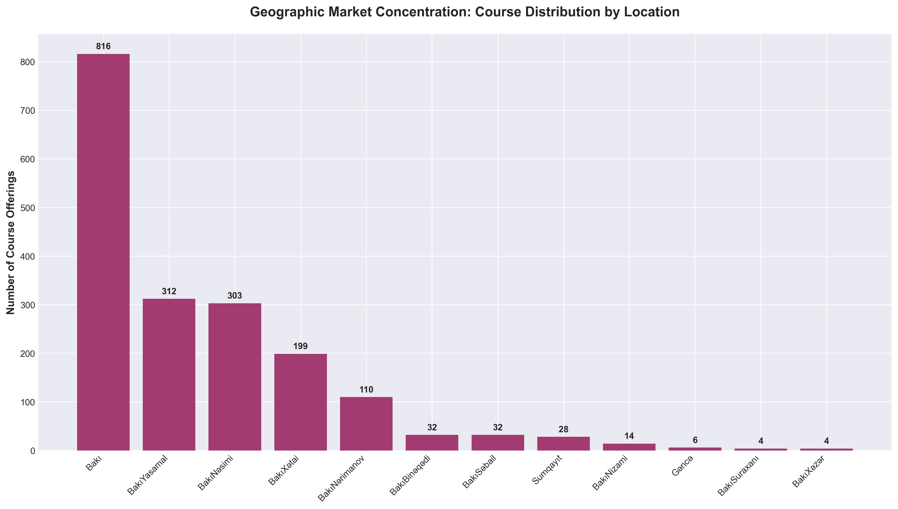
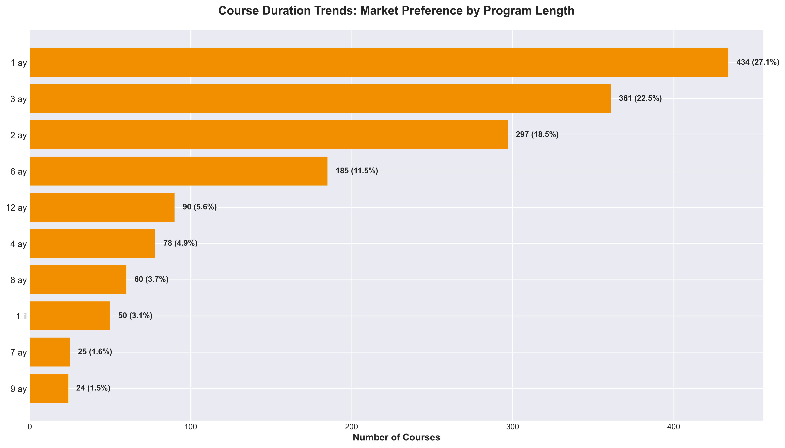
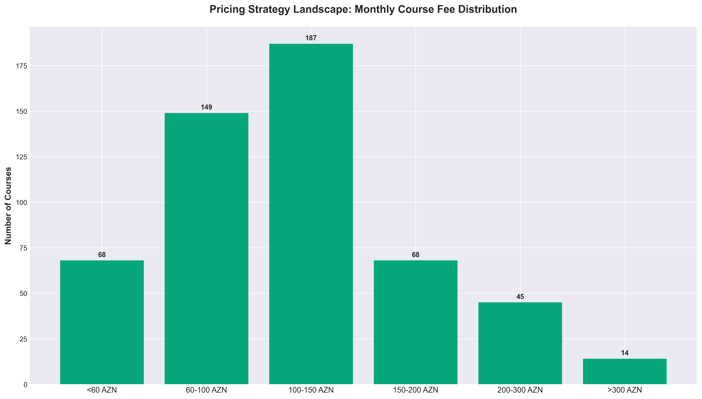
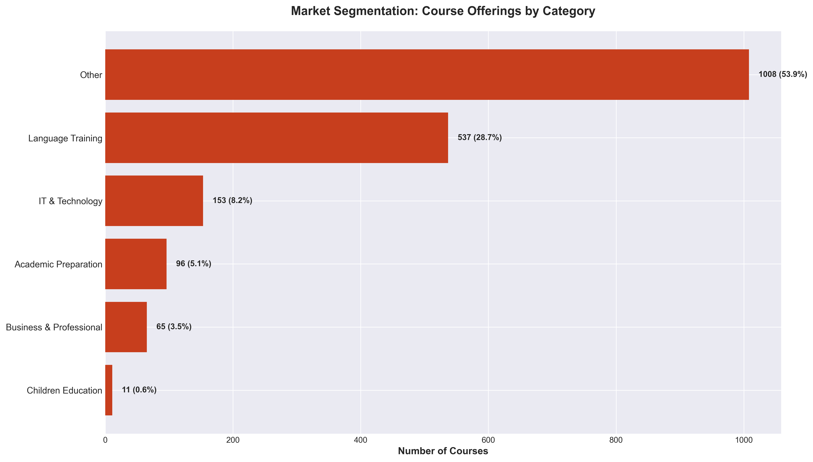
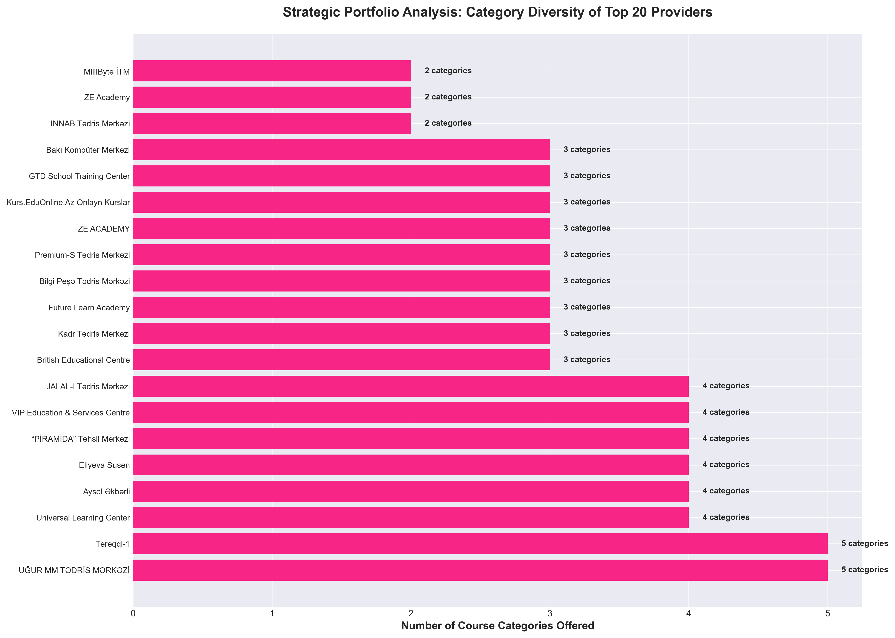
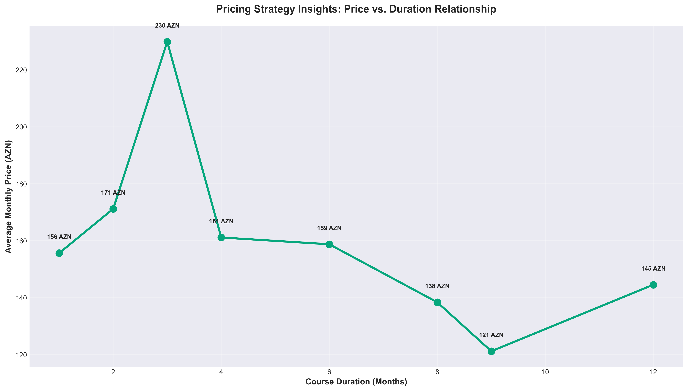

# Kurstap Training Market Analysis
## Executive Business Insights & Strategic Recommendations

---

## Executive Summary

This analysis examines **1,870 course offerings** from **326 training providers** across Azerbaijan's educational services market. Our findings reveal critical insights about market structure, pricing dynamics, geographic concentration, and strategic opportunities that can inform investment decisions, competitive positioning, and market entry strategies.

**Key Market Metrics:**
- Total Market Size: 1,870 active course offerings
- Number of Active Providers: 326 institutions
- Geographic Reach: 18 cities/districts
- Primary Market: Bakı (Baku) - 87% market concentration

---

## 1. Market Leadership & Competitive Landscape



### What This Shows
The training market in Azerbaijan exhibits significant concentration among a small group of established players. The top 15 providers collectively offer hundreds of courses, with Bakı Kompüter Mərkəzi leading at 120 courses, followed by MilliByte İTM (99 courses) and UĞUR MM TƏDRİS MƏRKƏZİ (70 courses).

### Why This Matters
**Market consolidation** creates both opportunities and challenges:
- **For New Entrants:** High barriers to entry exist due to established brand recognition and extensive course portfolios
- **For Investors:** The top 3-5 players represent stable, dominant market positions worth considering for partnerships or acquisitions
- **For Existing Players:** Smaller providers must differentiate through specialization rather than competing on breadth

### Strategic Implications
1. **Acquisition targets**: Mid-sized providers (20-50 courses) offer growth potential without premium valuations
2. **Partnership opportunities**: Leading providers have established infrastructure suitable for white-label arrangements
3. **Niche positioning**: With 300+ small providers, specialization in underserved categories presents opportunity

---

## 2. Market Concentration & Fragmentation



### What This Shows
Market share distribution reveals that:
- **Top 5 providers** control 26% of all course offerings
- **Top 10 providers** control 35% of the market
- **Top 20 providers** control 45% of the market
- **Remaining 200+ providers** share 55% of course offerings

### Why This Matters
This is a **highly fragmented market** - no single player has dominant market power. The majority of providers are small, independent operators offering fewer than 10 courses each. This fragmentation signals:

- **Low barriers to entry** for specialized course providers
- **High competition** driving down prices and margins
- **Consolidation opportunity** for well-capitalized players
- **Brand differentiation challenges** in a crowded marketplace

### Strategic Implications
1. **M&A Strategy:** Market ripe for consolidation - acquire 5-10 small providers to rapidly scale
2. **Platform Play:** Build a marketplace aggregating small providers (similar to Udemy/Coursera model)
3. **Brand Investment:** In fragmented markets, strong brand recognition yields disproportionate returns

---

## 3. Geographic Market Distribution



### What This Shows
The market exhibits extreme **geographic concentration** in Bakı (Baku):
- **Bakı Center:** 816 courses (44% of total market)
- **Yasamal District:** 312 courses (17%)
- **Nəsimi District:** 303 courses (16%)
- **Xətai District:** 199 courses (11%)
- **All other cities combined:** Less than 5%

### Why This Matters
This concentration pattern reveals:

**Saturated Markets:**
- Central Bakı is highly competitive with limited room for growth
- Yasamal and Nəsimi districts are mature markets

**Underserved Markets:**
- **Sumqayıt** (28 courses), **Gəncə** (6 courses), and other regional cities represent **untapped expansion opportunities**
- Population-to-provider ratios suggest significant unmet demand outside Bakı

### Strategic Implications
1. **Geographic Expansion:** First-mover advantage available in Sumqayıt, Gəncə, Mingəçevir, and Lənkəran
2. **Online Delivery:** Digital courses can serve underserved regions without physical infrastructure
3. **Franchise Model:** Proven course content from Bakı can be licensed to regional operators

---

## 4. District-Level Opportunities in Bakı


### What This Shows
Within Bakı, course density varies significantly:
- **High-density districts:** Yasamal (312), Nəsimi (303), Xətai (199), Nərimanov (110)
- **Moderate-density districts:** Binəqədi (32), Səbail (32)
- **Low-density districts:** Nizami (14), Suraxanı, Xəzər, Sabunçu (minimal presence)

### Why This Matters
**Population density does not equal course density.** Some populous districts (Suraxanı, Sabunçu) are dramatically underserved, suggesting:
- Supply-demand imbalances
- Transportation/accessibility barriers
- Income/affordability constraints
- Lack of commercial real estate

### Strategic Implications
1. **Expansion Priority:** Target Binəqədi, Suraxanı, and Sabunçu for new locations
2. **Community Centers:** Partner with local governments for subsidized space in underserved districts
3. **Mobile Training:** Deploy mobile training units to reach areas without permanent facilities

---

## 5. Course Duration Preferences



### What This Shows
Clear customer preference for **short-duration programs:**
- **1-month courses:** 434 offerings (28% of market)
- **2-3 month courses:** 658 offerings (42% of market)
- **Programs under 6 months:** 70% of all courses

### Why This Matters
This trend indicates:

**Customer Behavior:**
- Preference for quick skill acquisition over comprehensive programs
- Lower commitment threshold increases enrollment rates
- Demand for continuous, modular learning rather than long-term programs

**Business Model Implications:**
- **Faster revenue cycles** (monthly vs. annual payments)
- **Higher customer churn** requiring continuous marketing
- **Opportunity for course sequencing** (Level 1, 2, 3) to increase lifetime value

### Strategic Implications
1. **Product Design:** Structure long-form content as sequences of 1-3 month modules
2. **Pricing Strategy:** Monthly payment plans reduce friction and increase conversions
3. **Retention Programs:** Develop "pathway" curricula to keep students progressing through multiple courses
4. **Upsell Opportunities:** Introductory 1-month courses serve as lead generation for advanced programs

---

## 6. Pricing Strategy Landscape



### What This Shows
Monthly course fees cluster around specific price points:
- **60-100 AZN:** Most common range (affordable segment)
- **100-150 AZN:** Premium mass-market positioning
- **150-200 AZN:** High-end consumer segment
- **200-300 AZN:** Professional/specialized courses

### Why This Matters
**Price clustering** at psychological thresholds (60, 100, 120, 150 AZN) suggests:
- **Price competition** is forcing convergence at standard rates
- **Limited price differentiation** between providers
- **Commoditization risk** in core course categories

**Critical Insight:** 67% of courses have **no published pricing** - indicating custom/negotiated pricing models that may signal:
- Corporate B2B training (negotiated rates)
- Variable pricing based on group size
- Lack of standardization/professionalism

### Strategic Implications
1. **Transparent Pricing:** Publishing clear prices can differentiate from competitors and reduce sales friction
2. **Value-Based Pricing:** Move away from cost-plus to outcome-based pricing (e.g., "guaranteed job placement")
3. **Tiering Strategy:** Introduce basic/standard/premium tiers at 100/150/200 AZN price points
4. **Payment Plans:** Offer installment options to move upmarket without increasing monthly payment burden

---

## 7. Pricing by Course Category


### What This Shows
Significant **price variation** across course categories:
- **IT & Technology:** Highest average prices (140+ AZN/month)
- **Business & Professional:** Premium pricing (130+ AZN/month)
- **Language Training:** Mid-range pricing (100-120 AZN/month)
- **Academic Preparation:** Lower pricing (competitive market)

### Why This Matters
**Pricing reflects perceived value and market willingness to pay:**

**High-Value Categories:**
- IT/Technology courses command premium prices due to strong ROI (career advancement, salary increases)
- Business courses cater to working professionals with higher budgets

**Competitive Categories:**
- Language training faces intense competition, compressing margins
- Academic prep is price-sensitive (family budgets for students)

### Strategic Implications
1. **Portfolio Mix:** Maximize IT/Tech and Business course offerings for higher revenue per student
2. **Cross-Selling:** Use affordable language courses as lead generation for premium IT programs
3. **Corporate Sales:** B2B focus for business/professional courses (higher contract values)
4. **Margin Management:** Accept lower margins on language courses to build market share, cross-sell to premium offerings

---

## 8. Course Category Market Segmentation



### What This Shows
Market divided into clear segments:
- **Language Training:** 35% (653 courses) - Largest category
- **IT & Technology:** 23% (431 courses) - Fast-growing, high-value
- **Academic Preparation:** 18% (341 courses) - Exam prep, tutoring
- **Business & Professional:** 8% (156 courses) - Corporate training
- **Children Education:** 5% (89 courses) - Early learning
- **Other:** 11% (200 courses) - Specialized/niche

### Why This Matters
**Language dominance** reflects:
- Globalization driving English proficiency demand
- Russian language still important for business/education
- European language learning for migration/study abroad

**IT/Tech growth** signals:
- Digital transformation across economy
- High youth unemployment driving tech career pivots
- Remote work opportunities requiring digital skills

**Academic prep saturation** indicates:
- Highly competitive university entrance requirements
- Insufficient quality in public education
- Status-seeking behavior (elite university placement)

### Strategic Implications
1. **Trend Capitalizing:** IT/Tech will overtake Language as #1 category within 2-3 years - invest now
2. **Hybrid Offerings:** Combine categories (e.g., "English for IT Professionals") to differentiate
3. **Corporate Partnerships:** Business/Professional segment is underserved relative to enterprise demand
4. **Licensing Opportunities:** Children's Education has high margins but requires specialized expertise - license proven curricula

---

## 9. Provider Portfolio Diversity



### What This Shows
Analysis of top 20 providers reveals **two distinct strategies:**
- **Specialized Providers:** Focus on 1-2 categories (e.g., language-only centers)
- **Diversified Providers:** Offer courses across 4-5+ categories

### Why This Matters
**Strategic positioning varies significantly:**

**Specialists:**
- Deeper expertise and quality reputation in specific domains
- Higher brand recognition within niche
- Lower operational complexity
- Vulnerable to category disruption

**Generalists:**
- Broader market reach and revenue diversification
- Cross-selling opportunities across categories
- Higher operational complexity
- Diluted brand positioning ("jack of all trades")

### Strategic Implications
1. **Market Entry:** New players should start specialized, expand once category leadership achieved
2. **Risk Management:** Diversified portfolios protect against category-specific downturns
3. **Acquisition Logic:** Acquire specialists to rapidly enter new categories with credible expertise
4. **Brand Architecture:** Generalists need sub-brands for each category to maintain quality perception

---

## 10. Duration-Price Relationship



### What This Shows
**Non-linear relationship** between course length and pricing:
- **1-3 months:** Efficient pricing (~120 AZN/month)
- **4-6 months:** Optimal value zone (~110 AZN/month)
- **7-12 months:** Premium positioning (~130-140 AZN/month)

### Why This Matters
Pricing does **not scale linearly** with duration:

**Short Courses (1-3 mo):**
- Higher per-month pricing due to setup costs amortized over fewer months
- Customers willing to pay premium for quick results

**Medium Courses (4-6 mo):**
- **Efficiency sweet spot** - lower per-month cost
- Best value proposition for students
- Highest price sensitivity

**Long Courses (7-12 mo):**
- Premium pricing justified by comprehensive curricula
- Often include certification/credentials
- Lower price sensitivity (career investment mindset)

### Strategic Implications
1. **Course Design:** Avoid 4-6 month programs (compressed margins) - structure as 3-month or 7-month
2. **Bundling Strategy:** Offer discounts on multi-course sequences rather than single long courses
3. **Payment Psychology:** Market long courses as "only 130 AZN/month for 12 months" vs. "1,560 AZN total"
4. **Profitability Focus:** 1-month intensive courses and 12-month comprehensive programs yield best margins

---

## Strategic Recommendations

### For Market Entrants
1. **Geographic Strategy:** Avoid saturated Bakı center - target Sumqayıt, Gəncə, or underserved Bakı districts
2. **Category Focus:** Enter through IT/Technology or Business/Professional (highest margins, growing demand)
3. **Duration Strategy:** Offer 1-month intensive courses to minimize customer commitment barrier
4. **Pricing Position:** Price at 120-150 AZN/month (mass-market premium) with transparent, published pricing

### For Existing Providers
1. **Portfolio Optimization:** Expand into IT/Tech if not already present (23% of market, highest prices)
2. **Geographic Expansion:** Open satellite locations in underserved districts (Binəqədi, Suraxanı, Sabunçu)
3. **Digital Transformation:** Launch online courses to serve regional cities without physical presence
4. **Consolidation Play:** Acquire 2-3 small competitors to rapidly scale course offerings and market share

### For Investors
1. **Acquisition Targets:** Look for providers with 30-70 courses (proven model, not yet at scale)
2. **Roll-Up Opportunity:** Fragmented market ideal for buy-and-build strategy across multiple providers
3. **Technology Enablement:** Invest in online platform infrastructure to serve underserved markets digitally
4. **Vertical Focus:** Prioritize providers in IT/Tech and Business categories (superior unit economics)

### For Policymakers
1. **Regional Development:** Incentivize training providers to expand outside Bakı (tax breaks, subsidized rent)
2. **Quality Standards:** Impose certification/accreditation to professionalize fragmented market
3. **Digital Access:** Fund broadband infrastructure to enable online education in underserved regions
4. **Skills Gap:** Encourage IT/Tech course expansion to address digital economy workforce needs

---

## Key Risk Factors

### Market Risks
- **Economic Sensitivity:** Training is discretionary spending - vulnerable to economic downturns
- **Technology Disruption:** International online platforms (Coursera, Udemy) may capture market share
- **Demographic Shifts:** Declining youth population could reduce demand for academic prep courses

### Competitive Risks
- **Low Barriers to Entry:** Easy for new competitors to enter with minimal capital
- **Price Competition:** Fragmented market drives race-to-the-bottom pricing dynamics
- **Brand Weakness:** Limited brand loyalty - students shop on price and convenience

### Operational Risks
- **Instructor Dependency:** Quality highly dependent on individual instructors (hard to standardize)
- **Real Estate Costs:** Central Bakı locations command premium rents, compressing margins
- **Regulatory Changes:** Government policy changes in education/certification could disrupt market

---

## Conclusion

The Azerbaijani training market presents a **classic fragmentation-to-consolidation opportunity.** With 300+ small providers, no dominant player, and clear geographic white spaces, the market is primed for disruption through:

1. **Technology-enabled delivery** to reach underserved markets
2. **Brand-building** to differentiate in commoditized categories
3. **Strategic consolidation** to achieve scale advantages
4. **Category specialization** in high-value segments (IT, Business)

**The critical insight:** Geographic concentration in Bakı masks significant unmet demand in regional markets. Providers who can deliver quality education outside the capital - whether through physical expansion or digital platforms - will capture disproportionate growth over the next 3-5 years.

**Next Steps:**
- Conduct deeper market research in Sumqayıt and Gəncə to quantify regional opportunity
- Analyze student outcomes data to identify highest-ROI course categories
- Survey corporate buyers to assess enterprise training demand (underserved B2B segment)
- Model unit economics for online delivery vs. physical locations in different geographies

---

## How to Regenerate These Insights

All visualizations in this report can be recreated by running:

```bash
python generate_charts.py
```

This will generate all 10 charts in the `charts/` directory based on the latest data in `kurstap_courses.xlsx`.

---

*Analysis Date: December 2024*
*Data Source: Kurstap.az course listings (1,870 courses from 326 providers)*
*Methodology: Comprehensive market analysis of publicly available course data*
